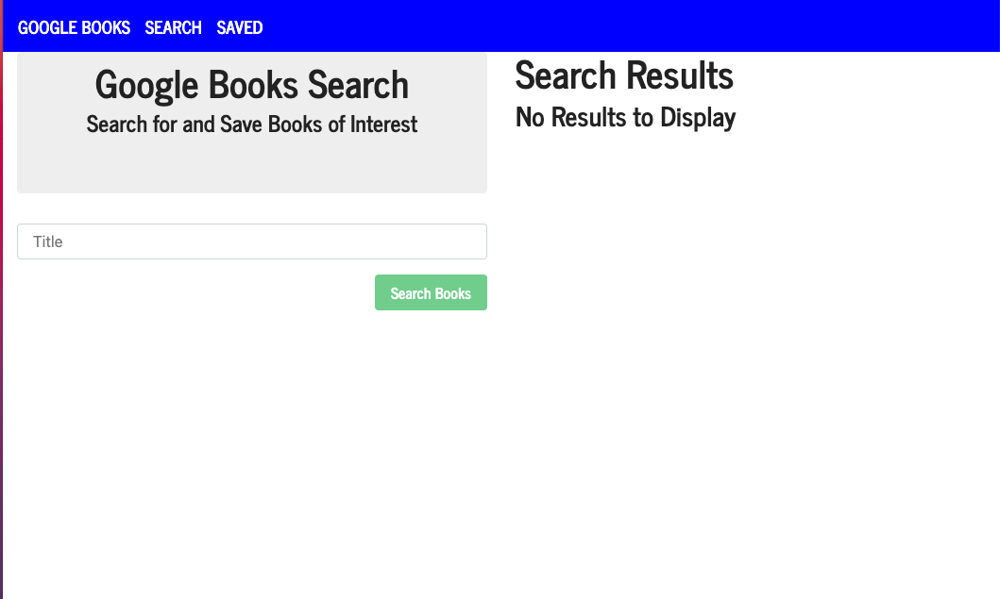
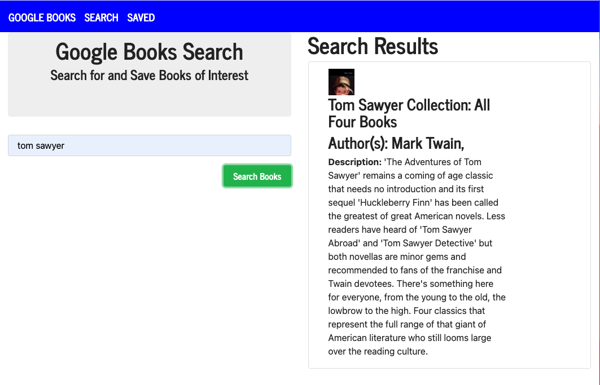
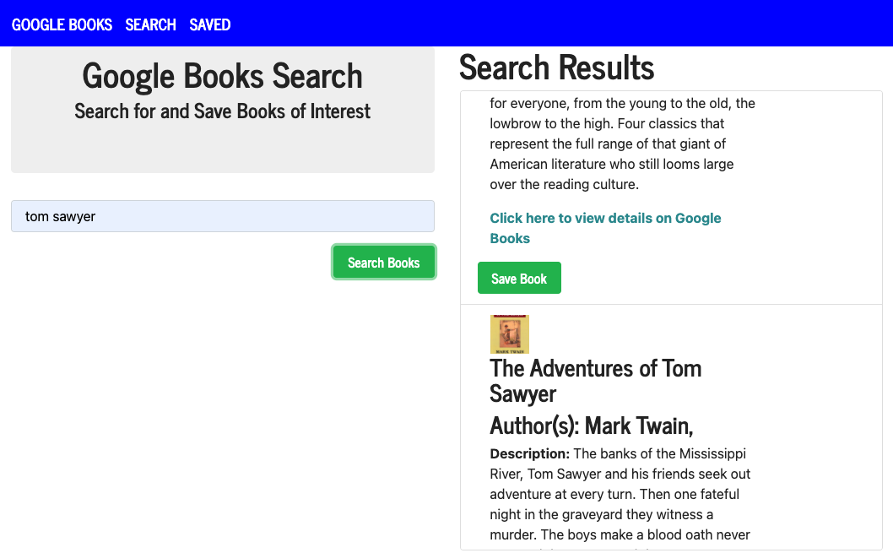
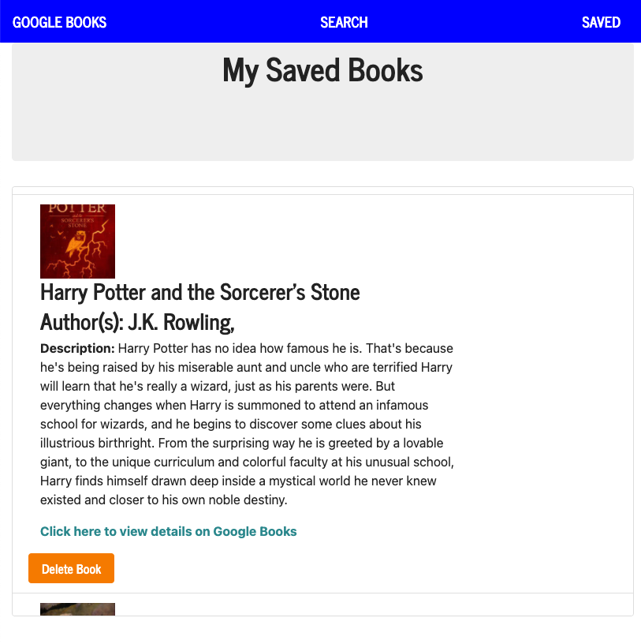

# Susan Fujii Google Books Search
  [](https://opensource.org/licenses/MIT)

## Description

  This MERN full-stack application uses MongoDB as its database, Express as its server-side web framework, React as its front-end client-side framework, and Node.js as its back-end javascript web server platform. This Google Books search app allows you to search any book via title or author from the Google Books API, and find any books that meet your criteria. You can then save these books, view your "personal library" (your saved books), see more detailed information about any book, or delete books from your reading list (your saved books).

  This web application is **accessible** to users who will view it both on larger computer screens and also on smaller screen sizes, and the code is **up to current industry standards** and **uses best known practices**.


## Table of Contents

  * [Installation](#installation)
  * [Usage](#usage)
  * [Screenshots](#screenshots)
  * [License](#license)
  * [Contribute](#contribute)
  * [Tests](#tests)
  * [Questions](#questions)


## Updated Portfolio

  This Google Books API Search & Save app is featured on my updated portfolio, which you can find here:

  [Susan Fujii Updated Portfolio](https://srfujii.github.io/UpdatedPortfolio_React/)
  

## Installation

  This Google Books API Search & Save app is also deployed live on Heroku, and you can find it live here:

  [Live Deployed Application](https://murmuring-citadel-81538.herokuapp.com/)
  

  To install locally, do the following: 
  
  To install necessary dependencies, run the following command:

  ```
  npm i
  ```

  To start the application, run:

  ```
  npm start
  ```

  The client side of this app was bootstrapped with [Create React App](https://github.com/facebook/create-react-app).


## Usage

  This is a student repo.


## Screenshots

  
  
  
  
  


## License

  [](https://opensource.org/licenses/MIT) This project is licensed under the [MIT](https://opensource.org/licenses/MIT) license.


## Contribute

  Contributions are always welcome! (Please fork and pull request only.)


## Tests

  To run tests, run the following command: 

  ```
  npm test
  ```

## Questions

  If you have any questions about the repo, open an issue or contact me directly at susan.fujii@me.com. You can find more of my work at [srfujii](https://github.com/srfujii/).
